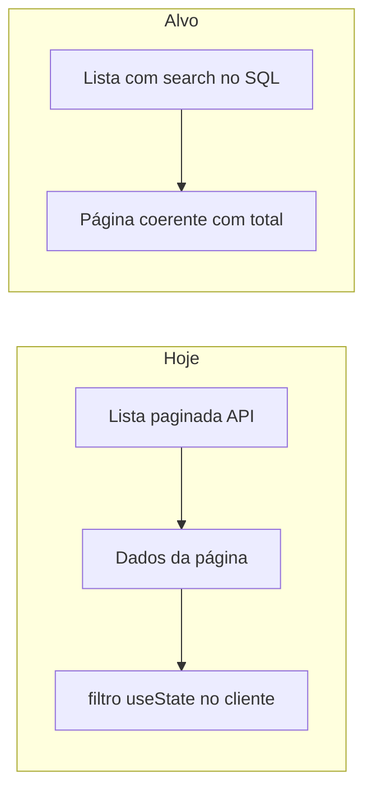

# Busca server-side na lista de patrocinadores

## Diagnóstico

- Em [`backoffice-front/src/pages/sponsor/sponsor-list-page.tsx`](backoffice-front/src/pages/sponsor/sponsor-list-page.tsx), `searchTerm` aplica `sponsors.filter(...)` só sobre `data` da página corrente; **não há parâmetro de busca** em [`useUserListQuery`](backoffice-front/src/hooks/use-user-list-query.ts) / [`userApi.getUsers`](backoffice-front/src/api/user-api.ts).
- No backend, [`UserRepository.findAllPaginated`](backoffice/src/main/java/backoffice/v1/repositories/UserRepository.java) não aceita texto de busca; a cadeia é `AdminResource.listUsers` → [`AdminService.listUsers`](backoffice/src/main/java/backoffice/v1/services/AdminService.java) → [`UserService.listUsers`](backoffice/src/main/java/backoffice/v1/services/UserService.java) → repositório.

## Backend (backoffice)

1. **DTO de query** — Em [`ListUsersQueryDTO`](backoffice/src/main/java/backoffice/v1/dtos/user/ListUsersQueryDTO.java), adicionar `@QueryParam("search")` com `@Size(max = …)` (ex.: 100) e mensagem alinhada a novo valor em [`MessageErrorEnum`](backoffice/src/main/java/backoffice/common/exceptions/MessageErrorEnum.java). Tratar string só espaços como “sem filtro” (método `resolveSearch()` ou equivalente).

2. **Contrato OpenAPI** — Atualizar [`AdminApi`](backoffice/src/main/java/backoffice/v1/openapi/api/AdminApi.java) (`@Operation` / `@Parameter` para `search`).

3. **Repository** — Estender `findAllPaginated` com `String search` opcional. Quando preenchido, acrescentar à cláusula `WHERE` um grupo **OR** que cubra:
   - **Nome público**: `exists (select 1 from Sponsor s where s.user = u and lower(s.publicName) like :searchLike)` (mesmo padrão de `exists` já usado para tier/entity/persona).
   - **Documento**: `lower(u.document) like :searchLike` **e**, se o termo contiver dígitos, também casar substring nos **só dígitos** do documento (ex.: `function('regexp_replace', u.document, '[^0-9]', '', 'g') like :docDigitsLike` no JPQL/Hibernate, compatível com PostgreSQL dos testes). Assim buscas com ou sem máscara funcionam quando o valor persistido for numérico ou formatado.
   - **Código**: `lower(u.code) like :searchLike`.
   - **(Opcional mas alinhado ao comportamento atual do front)** incluir `lower(u.name) like :searchLike` para “nome da conta”, já que a tela hoje também filtra por `name`.

   Escapar `%` e `_` do termo ao montar o padrão `LIKE` (e usar `escape` se necessário) para evitar injeção de curingas.

4. **Service** — [`UserService.listUsers`](backoffice/src/main/java/backoffice/v1/services/UserService.java) e [`AdminService.listUsers`](backoffice/src/main/java/backoffice/v1/services/AdminService.java): propagar `search` resolvido do DTO. [`PublicService.listActiveSponsors`](backoffice/src/main/java/backoffice/v1/services/PublicService.java) continua sem busca (passar `null`).

5. **Resource** — [`AdminResource.listUsers`](backoffice/src/main/java/backoffice/v1/resources/AdminResource.java): passar `query.resolveSearch()` (ou similar) para o service.

## Frontend (backoffice-front)

1. **Tipos e API** — Em [`UserListParams`](backoffice-front/src/types/user.ts), adicionar `search?: string`. Em [`userApi.getUsers`](backoffice-front/src/api/user-api.ts), enviar `search` só quando não vazio (axios omite `undefined`).

2. **Debounce 300ms** — Criar hook reutilizável (ex.: [`src/hooks/use-debounced-value.ts`](backoffice-front/src/hooks/use-debounced-value.ts)) com `useEffect` + `setTimeout` 300ms; na página, manter estado imediato do input e derivar valor debounced para a query.

3. **`SponsorListPage`** — Em [`sponsor-list-page.tsx`](backoffice-front/src/pages/sponsor/sponsor-list-page.tsx):
   - Passar `search: debouncedTrimmed || undefined` para `useUserListQuery`.
   - `useEffect` para `setPage(1)` quando o valor debounced de busca mudar.
   - Remover `filteredSponsors` e usar `sponsors` (ou `data?.data`) direto.
   - Ajustar textos de ajuda (“refinam no servidor”, placeholder mencionando nome público, documento e código).
   - Manter `keepPreviousData` no hook existente para UX estável durante refetch.

4. **Vitest** — O projeto já tem `vitest` no [`package.json`](backoffice-front/package.json) mas sem `test` em `src`. Adicionar bloco `test` em [`vite.config.ts`](backoffice-front/vite.config.ts) (`environment: 'jsdom'`, `setupFiles` com `@testing-library/jest-dom`) e:
   - Teste unitário do hook `useDebouncedValue` com `vi.useFakeTimers()`.
   - (Opcional enxuto) teste que um módulo de params monta o objeto esperado para a API, se quiser evitar montar Router/Query em todo teste.

## Testes backend (sem “excesso” de escrita)

Seguir o estilo de [`AdminResourceUserTest`](backoffice/src/test/java/backoffice/v1/resources/AdminResourceUserTest.java) (RestAssured + `@TestSecurity`):

- Um teste **somente leitura**: `GET /v1/admin/user?type=SPONSOR&search=...` retorna **200** e envelope paginado (como os testes de filtro existentes).
- Um fluxo **mínimo com escrita**: um `POST` de patrocinador com `publicName` / `document` / `code` **marcados** (helpers já existem) seguido de **um** `GET` com `search` igual a um fragmento exclusivo de cada campo, assertando que o usuário criado aparece em `data` (e idealmente que um termo que não casa não retorna esse registro na primeira página, se o volume de dados de teste permitir). Isso é poucas operações de persistência, alinhado ao pedido de não martelar o banco.

Não é necessário novo seed em massa nem migração de schema (apenas colunas já existentes em [`User`](backoffice/src/main/java/backoffice/v1/entities/User.java) e [`Sponsor`](backoffice/src/main/java/backoffice/v1/entities/Sponsor.java)).

## Verificação

- Backend: `mvn test` (ou escopo da classe `AdminResourceUserTest` + novos casos).
- Front: `pnpm test` após configurar Vitest no Vite.
