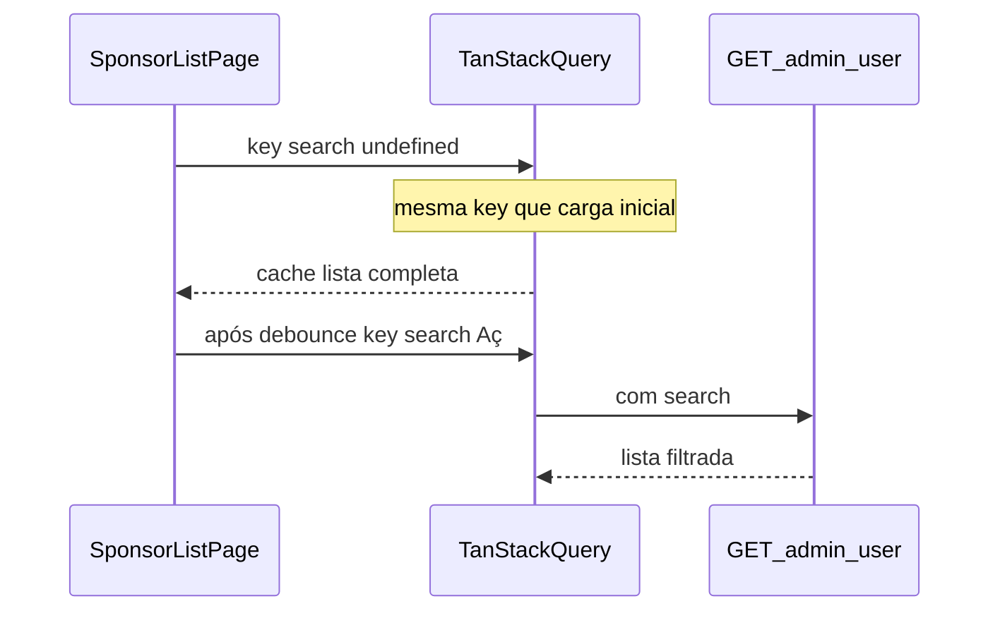

# Correção da busca na lista de patrocinadores

## Causa raiz (filtro “não funciona”)

Em [`use-user-list-query.ts`](backoffice-front/src/hooks/use-user-list-query.ts), a `queryKey` é `['users', params]` com `params.search` vindo só do valor **debounced** em [`sponsor-list-page.tsx`](backoffice-front/src/pages/sponsor/sponsor-list-page.tsx).

Enquanto `debouncedSearch` ainda não alcançou o texto digitado, `search` continua `undefined` — a chave fica **idêntica** à primeira listagem (SPONSOR, sem `search`). O TanStack Query **reutiliza o cache** da página inteira; com `placeholderData: keepPreviousData` o utilizador continua a ver **todos os registos** até o debounce terminar e a nova chave disparar o fetch filtrado. Isto explica “consulto por Aç e aparecem todos”, especialmente com colagem num único passo ou se o utilizador julga o resultado antes do atraso.

O backend em [`UserRepository.findAllPaginated`](backoffice/src/main/java/backoffice/v1/repositories/UserRepository.java) com `search` preenchido está coerente com `LIKE` + `exists` em `publicName`; não é necessário alterar a SQL para este sintoma (a menos que surja outro bug depois do fix de cache).

## Alterações pedidas (simples)

1. Em [`sponsor-list-page.tsx`](backoffice-front/src/pages/sponsor/sponsor-list-page.tsx): `SEARCH_DEBOUNCE_MS` de `300` para `500`.
2. No mesmo ficheiro: remover o bloco `
` e remover `aria-describedby="sponsor-search-hint"` do [`Input`](backoffice-front/src/pages/sponsor/sponsor-list-page.tsx) (evitar referência a elemento inexistente).

## Correção do filtro / cache

3. Em [`use-user-list-query.ts`](backoffice-front/src/hooks/use-user-list-query.ts): substituir `placeholderData: keepPreviousData` por uma função que **só** reutiliza dados anteriores quando o parâmetro `search` não mudou (comparar `prev` vs `params` via `previousQuery?.queryKey[1]` tipado como `UserListParams`). Quando `(prev?.search ?? '') !== (params.search ?? '')`, devolver `undefined` (sem placeholder), forçando estado de carregamento até à resposta filtrada — mantém o efeito desejado de `keepPreviousData` para **mudanças de página** e outros filtros, sem mostrar a lista completa “falsa” ao mudar o texto de busca.

4. (Opcional, se quiserem feedback explícito) Na página, usar `isFetching` da query para um indicador discreto na secção da tabela; não é obrigatório se o passo 3 resolver a perceção.

## Testes

5. Atualizar [`use-debounced-value.test.ts`](backoffice-front/src/hooks/use-debounced-value.test.ts) onde o delay está fixo em `300` para `500` **ou** importar uma constante partilhada — o mais simples é alinhar os números no teste ao novo debounce (500 ms nos `advanceTimersByTime`).

## Verificação

- `pnpm test run` no `backoffice-front`.
- Smoke manual: colar “Aç” na busca — após ~500 ms a lista deve refletir só correspondências; durante o intervalo não deve voltar a mostrar a página 1 completa em cache como “resultado final”.
