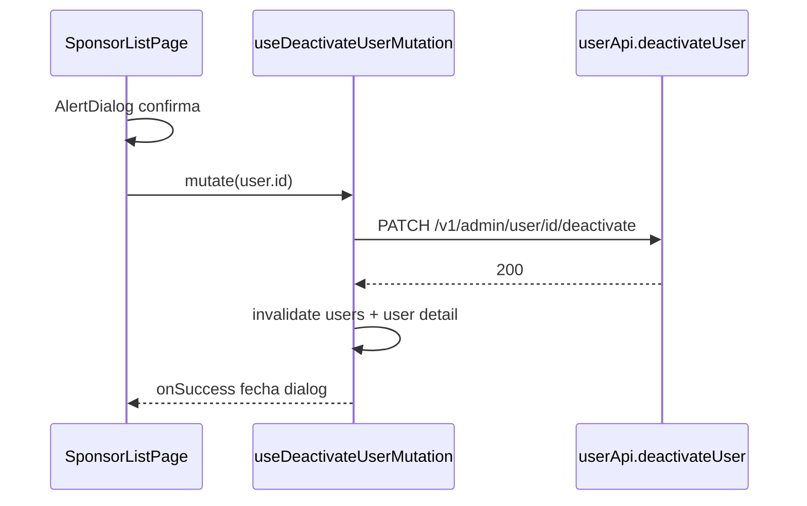

# Desativar patrocinador na lista (soft delete)

## Contexto técnico

- A página `[src/pages/sponsor/sponsor-list-page.tsx](src/pages/sponsor/sponsor-list-page.tsx)` já lista utilizadores com `useUserListQuery({ type: "SPONSOR", ... })`; cada linha é um `[UserWithSponsorDTO](src/types/user.ts)` com `id` (utilizador) e `sponsor.isActive` (alinhado ao badge "Ativo/Inativo").
- A API não expõe `PATCH .../sponsor/.../deactivate`: a desativação lógica de patrocinador segue `[PATCH /v1/admin/user/{id}/deactivate](.cursor/rules/api-docs/api-endpoints.yml)` com `**id` = `user.id**`, como descrito nas [regras de negócio](.cursor/rules/business-rule.mdc) (conta, patrocinador e benefícios vinculados).
- Referência de UX/código: `[src/pages/benefit/benefit-list-page.tsx](src/pages/benefit/benefit-list-page.tsx)` (estado `deactivateDialogOpen` + `*ToDeactivate`, `handleDeactivate` / `confirmDeactivate`, `AlertDialog` com `font-serif` no título, botão confirmar `destructive`, bloqueio do diálogo enquanto `isPending`) e `[src/hooks/use-deactivate-benefit-mutation.ts](src/hooks/use-deactivate-benefit-mutation.ts)` (toast sucesso/erro, `getApiErrorMessage`, invalidação de queries).

## Implementação

### 1. Camada API — `[src/api/user-api.ts](src/api/user-api.ts)`

- Adicionar `deactivateUser(id: number)` que faz `api.patch(\`/v1/admin/user/${id}/deactivate)`, no mesmo estilo de` [benefitApi.deactivateBenefit](src/api/benefit-api.ts)` (sem necessidade de mapear corpo se a resposta for void/envelope vazio).

### 2. Hook — novo ficheiro `src/hooks/use-deactivate-user-mutation.ts`

- `useMutation` com `mutationFn: (id: number) => userApi.deactivateUser(id)`.
- `onSuccess`: `invalidateQueries({ queryKey: ['users'] })` para refletir a lista (a query key atual é `['users', params]` em `[use-user-list-query.ts](src/hooks/use-user-list-query.ts)`); também `invalidateQueries({ queryKey: ['user', id] })` para alinhar com `[use-user-with-sponsor-query](src/hooks/use-user-with-sponsor-query.ts)` caso o detalhe esteja em cache.
- `onError`: `toast.error` com `getApiErrorMessage` e mensagens de fallback análogas ao benefício (403/400 vs genérico).
- `onSuccess`: `toast.success` com texto adequado, por exemplo "Patrocinador desativado." ou "Utilizador desativado." (preferir linguagem de patrocinador nesta página).

### 3. UI — `[src/pages/sponsor/sponsor-list-page.tsx](src/pages/sponsor/sponsor-list-page.tsx)`

- Importar componentes `AlertDialog*` (como na benefit list), ícones `Eraser` e `Trash2`, e `useDeactivateUserMutation`.
- Estado: `deactivateDialogOpen`, `userToDeactivate: UserWithSponsorDTO | null` (importar o tipo de `@/types/user`).
- Na célula de ações: envolver ações num `div` com `flex justify-end gap-1` (igual ao benefício). Manter o botão de editar; quando `user.sponsor?.isActive`, mostrar botão `Eraser` (variant ghost, `text-destructive`, `aria-label` de desativar, `disabled` se `isPending`) e ao lado `Trash2` **sempre `disabled`** com `title`/`aria-label` indicando apagar indisponível (mesmo padrão da benefit list).
- Coluna de ações: alargar de `w-[52px]` para algo compatível com 3 ícones (ex. `min-w-[140px]` ou `w-[100px]` como em benefícios — ajustar header `TableHead` e skeleton na mesma proporção).
- `AlertDialog`: título tipo "Desativar patrocinador?"; descrição em português objetivo mencionando desativação **lógica** e efeitos relevantes ao ADM (conta sem login, patrocinador e benefícios associados desativados), alinhado às regras de negócio, sem jargão técnico de API.
- `onOpenChange` do diálogo: não fechar enquanto `deactivateMutation.isPending` (copiar o guard da benefit list).

### 4. Design e acessibilidade (`[design-pattern.mdc](.cursor/rules/jet-landing-page/design-pattern.mdc)`)

- Reutilizar `Button` ghost/destructive e tokens semânticos já usados na benefit list (`text-destructive`, `muted-foreground` no lixo desabilitado).
- Garantir `aria-label` / `sr-only` nas ações icónicas e título do diálogo com `font-serif` para consistência com a outra listagem administrativa.

## Ficheiros tocados (resumo)

| Ficheiro                                                                             | Alteração                   |
| ------------------------------------------------------------------------------------ | --------------------------- |
| `[src/api/user-api.ts](src/api/user-api.ts)`                                         | `deactivateUser`            |
| `src/hooks/use-deactivate-user-mutation.ts`                                          | novo                        |
| `[src/pages/sponsor/sponsor-list-page.tsx](src/pages/sponsor/sponsor-list-page.tsx)` | ações, dialog, estado, hook |
| (opcional) nenhum outro                                                              | —                           |

## Riscos / notas

- **Hard delete**: o YAML menciona DELETE em `/v1/admin/user/{id}` como exclusão física; não expor na UI além do `Trash2` desabilitado (já pedido).
- **Filtro "Ativo"**: após desativar, o item pode desaparecer da vista se o filtro for só ativos — comportamento esperado; a invalidação de `['users']` garante dados atualizados.
